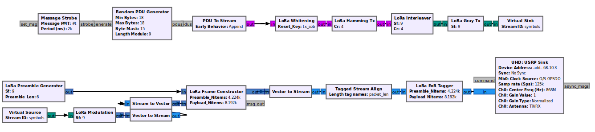
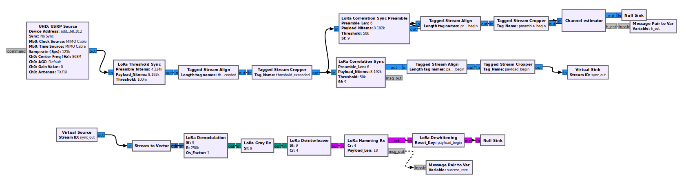
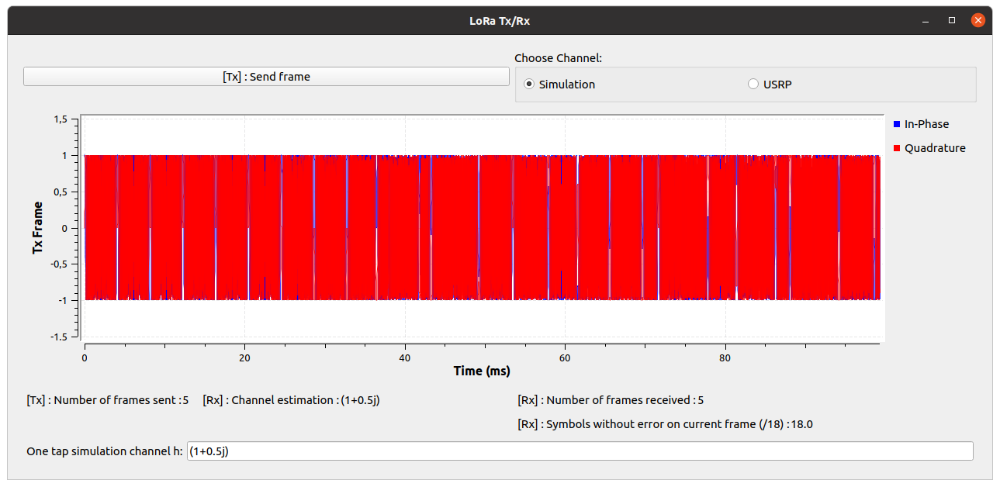
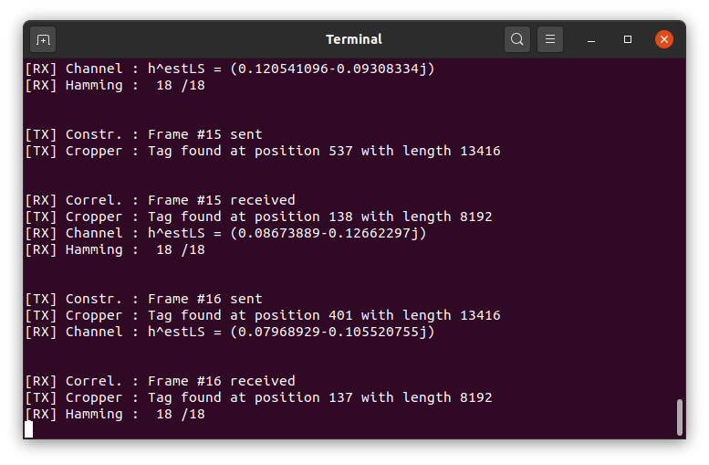

## Introduction

This is a GNU Radio implementation of a LoRa prototype transceiver in embedded python blocks.
This work has been conducted at the IETR lab in Rennes, France.

* In the Tx chain, the implementation contains the main blocks of the LoRa transceiver: whitening, Hamming encoding, interleaver block, Gray mapping, and the modulation block. 

* On the receiver side there is the packet synchronization chain, which performs all the necessary tasks needed for time synchronization. Once synchronized, the payload goes through the demodulation block, Gray demapping, deinterleavingblock , Hamming decoder block and dewhitening block. 

## Implemented functionalities

* Sending and receiving LoRa packets between two USRPs (NI USRP-2920).
* Parameters available :
    - SF = 9
    - CR = 4
* Correlation is used for synchronization.
* One tap channel estimation at Rx using preamble (could be used for post-equalization at receiver). This feature has only been tested in simulation.

## Reference

TODO : Link to intership report

## Prerequisites

* GNU Radio 3.10 
* Python 3.8
* UHD (for USRP communication w/ computer)

## Installation

* Download the zip archive and extract it

## Usage

* ``/tx_rx_nice_gui/modules_test_nice_GUI.grc`` is an example LoRa transceiver (Tx + Rx) with a control QT GUI.  
Type : ``gnuradio-companion /tx_rx_nice_gui/modules_test_nice_GUI.grc`` to run it in GRC.

* ``/tx_rx_no_gui/modules_test_no_GUI.grc`` is another example LoRa transceiver (Tx + Rx), this time with no GUI.   
Type : ``gnuradio-companion /tx_rx_no_gui/modules_test_no_GUI.grc`` to run it in GRC.

## Known errors
* os_factor != 1 will cause problems as the oversampling functionality hasn't been properly implemented yet.
* Be careful when changing the following variables : ``preamble_len``, ``payload_len``, ``CR``, ``SF``. As some blocks will not update automatically their default constructor values (https://github.com/gnuradio/gnuradio/issues/4196). This error is due the fact that we are using embedded python blocks instead of OOT blocks.

## Notes

* This work was inspired from https://github.com/rpp0/gr-lora by P. Robyns, P. Quax, W. Lamotte and W. Thenaers, and https://github.com/tapparelj/gr-lora_sdr by J. Tapparel, O. Afisiadis, P. Mayoraz, A. Balatsoukas-Stimming, and A. Burg.  
Those implementations use C++ blocks and aren't implemented in GNU Radio 3.10.
I used python embedded blocks for easier prototyping and improved flexibility.

* Possible improvements are :
    - Better time synchronization
    - Adding frequency synchronization
    - Adding every SF and CR
    - Adding CRC and header